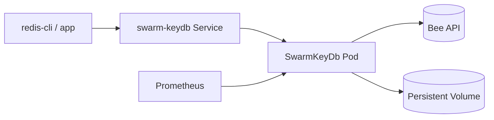

# SwarmKeyDb Helm Chart

Deploy SwarmKeyDb to Kubernetes using the official chart.

## Quick Start

```bash
helm repo add swarm-keydb https://scholtz.github.io/swarm-keydb/
helm repo update
helm upgrade --install swarm-keydb swarm-keydb/swarm-keydb \
  --namespace swarm-keydb \
  --create-namespace \
  --set env.beeUrl=http://swarm-bee-api.swarm-keydb.svc.cluster.local:1633 \
  --set secret.beePostageBatchId=<your-postage-batch-id>
```

## Install Bee (Swarm) first

SwarmKeyDb expects a reachable Bee API endpoint before serving `bee` backend writes.

If you deploy Bee with Helm, use your Bee chart repository and install it into the same namespace:

```bash
helm repo add bee <your-bee-helm-repo-url>
helm repo update
helm upgrade --install swarm-bee bee/<your-bee-chart-name> \
  --namespace swarm-keydb \
  --create-namespace \
  --set service.nameOverride=swarm-bee-api \
  --set service.port=1633
```

If your Bee chart uses a different service name, set `env.beeUrl` to the Bee service DNS name when installing SwarmKeyDb.

## Required configuration

- `env.beeUrl`
- `secret.beePostageBatchId`

## Production example

Use the checked-in production baseline:

```bash
helm install my-swarm-keydb swarm-keydb/swarm-keydb -f helm/swarm-keydb/values-production.yaml
```

## Key values

- `image.repository`, `image.tag`
- `replicaCount`
- `resources.requests`, `resources.limits`
- `service.type`
- `env.redisPort`, `env.dashboardPort`, `env.metricsPort`
- `secret.encryptionKey`, `secret.encryptionEthKey`, `secret.privacyKey`

## Architecture diagram


