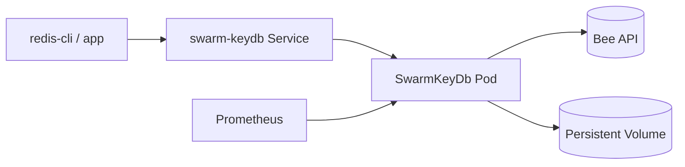

# SwarmKeyDb Helm Chart

Deploy SwarmKeyDb to Kubernetes using the official chart.

## Quick Start

```bash
helm repo add swarm-keydb https://scholtz.github.io/swarm-keydb/
helm repo update
helm upgrade --install swarm-keydb swarm-keydb/swarm-keydb \
  --namespace swarm-keydb \
  --create-namespace \
  --set secret.beePostageBatchId=<your-postage-batch-id>
```

By default the chart uses `https://bzz.limo` for `env.beeUrl`.

## Install Bee (Swarm) first

SwarmKeyDb expects a reachable Bee API endpoint before serving `bee` backend writes.

Use the Bee Helm repo and chart directly:

```bash
helm repo add ethersphere https://ethersphere.github.io/helm
helm repo update
helm install --generate-name ethersphere/bee \
  --namespace swarm-keydb \
  --create-namespace
```

Then point SwarmKeyDb at the Bee service DNS name from your generated release:

```bash
kubectl -n swarm-keydb get svc
helm upgrade --install swarm-keydb swarm-keydb/swarm-keydb \
  --namespace swarm-keydb \
  --create-namespace \
  --set env.beeUrl=http://<bee-service-name>.swarm-keydb.svc.cluster.local:1633 \
  --set secret.beePostageBatchId=<your-postage-batch-id>
```

## Required configuration

- `env.beeUrl`
- `secret.beePostageBatchId`

## Production example

Use the checked-in production baseline:

```bash
helm install my-swarm-keydb swarm-keydb/swarm-keydb -f helm/swarm-keydb/values-production.yaml
```

## Key values

- `image.repository`, `image.tag`
- `replicaCount`
- `resources.requests`, `resources.limits`
- `service.type`
- `env.redisPort`, `env.dashboardPort`, `env.metricsPort`
- `secret.encryptionKey`, `secret.encryptionEthKey`, `secret.privacyKey`

## Architecture diagram


